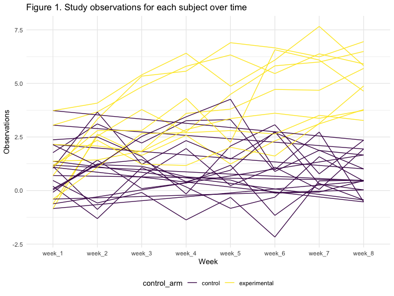

Homework 5
================
Lorraine Kwok
November 5, 2019

## Problem 1

The following code chunk generates missing values in the
`iris_with_missing` dataframe.

``` r
iris_with_missing = iris %>% 
  map_df(~replace(.x, sample(1:150, 20), NA)) %>%
  mutate(Species = as.character(Species))
```

The following code chunk shows a function that will replace the missing
values in each variable. For numeric variables, the missing values will
be replaced with column mean. For character variables, the

``` r
output = vector("list", length = 5)

iris_filling = function(x) {
  
  if (is.numeric(x)) {
    x = replace_na(x, mean(x, na.rm = TRUE))
  }
  else if (is.character(x)) {
    x = replace_na(x, "virginica")
  }
  
}

output = map(iris_with_missing, iris_filling)
```

## Problem 2

This code chunk creates a dataframe that consists of the file names and
converts it into a vector.

``` r
df = list.files(pattern = "*.csv")

vec_file = str_c(df)
```

This code chunk creates a function that reads in data for each subject
from each individual csv file and saves the weekly observations as a new
varaible in the dataframe.

``` r
for (i in length(df):1) {
  output[[i]] = read_csv(vec_file[[i]])
}

output = cbind(vec_file, map_df(vec_file, read_csv))
```

This code chunk tidies the resulting dataframe obtained from the for
loop.

``` r
study_df = 
  output %>%
  separate(vec_file, c("control_arm", "subject_id")) %>%
  separate(subject_id, c("subject_id", "csv"), ".csv") %>%
  select(-csv) %>%
  mutate(control_arm =
           recode(control_arm, con = "control", exp = "experimental")) %>%
  pivot_longer(cols = starts_with("week_"),
               names_to = "week",
               values_to = "obs")
```

The following code chunk creates a spaghetti plot that shows the
observations for each subject over time.

``` r
study_df %>%
  group_by(control_arm, subject_id) %>%
  ggplot(aes(x = week, y = obs, group = subject_id, color = control_arm)) +
  geom_path() + 
  labs(title = "Figure 1. Study observations for each subject over time",
       x = "Week",
       y = "Observations")
```



Based on the spaghetti plot, subjects in the control arm seem to have
lower numbers of observations compared to those in the experimental
arm.There is a bit of overlap between the two study arms between 1.25
and 3.75 numbers of observations.

## Problem 3

This code chunk creates a function that simulates data for a simple
linear regression for a sample size of 30, β0 of 2 and β1 of 0 and fits
the regression model.

``` r
sim_regression = function(n = 30, beta0 = 2, beta1 = 0) {
  
  sim_data = tibble(
    x1 = rnorm(30, 0, 1),
    y = beta0 + beta1 * x1 + rnorm(30, 0, 50)
  )
  
  ls_fit = lm(y ~ x1, data = sim_data) %>%
    broom::tidy()
}
```

The following code chunk allows us to run `sim_regression()` 10000 times
and generates a dataframe reporting each β̂1 and p-value.There is also
code that tidies up some of these data.

``` r
output2 = vector("list", 10000)

for (i in 1:10000) {
  output2[[i]] = sim_regression(n)
}
  
sim_results =
  rerun(10000, sim_regression()) %>%
  bind_rows(output2) %>%
  select(term, p.value) %>%
  filter(term == "x1") %>%
  mutate(term = str_replace(term, "x1", "beta1_hat"))
```

The following code chunk runs a simulation with different values for β1.

``` r
beta1_list = list("beta1_1"  = 1, 
              "beta1_2"  = 2, 
              "beta1_3" = 3, 
              "beta1_4" = 4,
              "beta1_5" = 5,
              "beta1_6" = 6)
output3 = vector("list", length = 6)

for (i in 1:6) {
  output3[[i]] = rerun(10000, sim_regression(beta1_list[[i]])) %>% 
    bind_rows() %>%
    select(term, p.value) %>%
    filter(term == "x1") %>%
    mutate(term = str_replace(term, "x1", "beta1_hat"))
}
```
